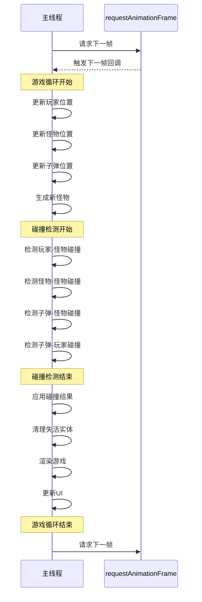
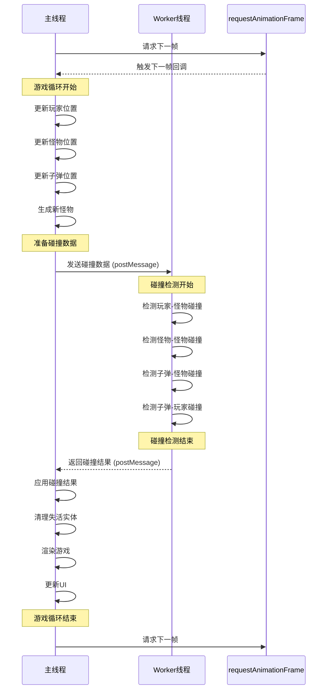
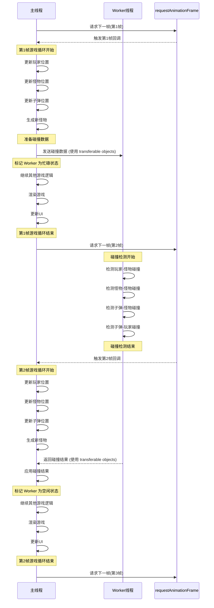

# 游戏 Worker 版本流程对比

本文档比较了游戏的两个版本的流程时序图：原始版本和使用 Web Worker 的版本。

## 原始版本流程

在原始版本中，所有游戏逻辑（包括碰撞检测）都在主线程中执行。

## Web Worker 版本流程

在 Web Worker 版本中，碰撞检测被移到了 Worker 线程中执行，主线程负责游戏逻辑和渲染。

### 第一版 Worker 实现（主线程等待 Worker 结果）

### 最终优化版 Worker 实现（主线程不等待 Worker 结果）

## 两个版本的主要区别

1. **原始版本**：
   - 所有处理都在主线程中进行
   - 碰撞检测可能导致主线程阻塞，影响帧率
   - 实现简单，无需处理线程间通信

2. **第一版 Worker 实现**：
   - 碰撞检测在 Worker 线程中进行
   - 主线程等待 Worker 返回结果，仍可能导致阻塞
   - 减轻了主线程负担，但通信开销可能抵消部分性能提升

3. **最终优化版 Worker 实现**：
   - 碰撞检测在 Worker 线程中进行
   - 主线程不等待 Worker 返回结果，继续处理下一帧
   - Worker 结果在下一帧或之后的帧中应用
   - 使用 transferable objects 优化数据传输
   - 主线程完全不阻塞，可以保持高帧率
   - 碰撞结果有一帧的延迟，但在游戏中几乎不可察觉
